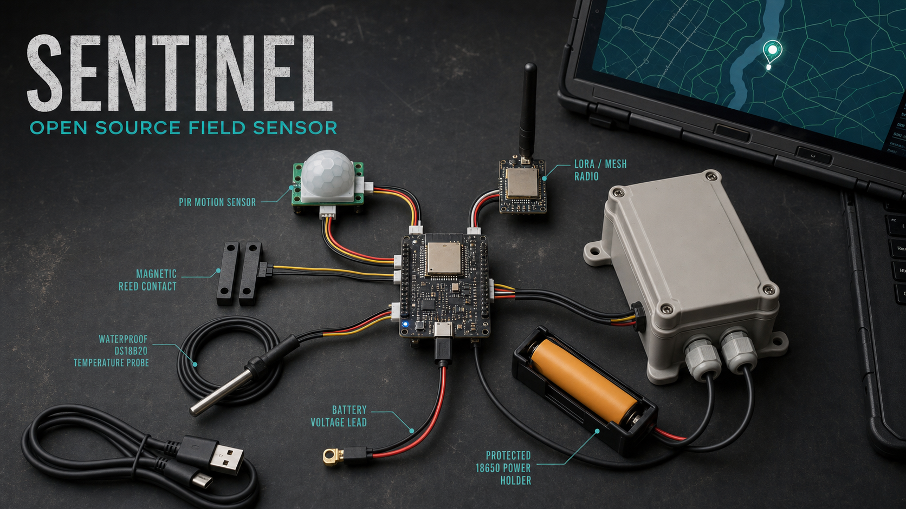
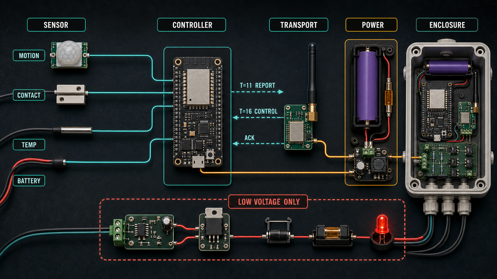

# Sentinel Wiki

Sentinel is an open-source field sensor for the MKME X Suite. XTOC and XCOM decode and display its reports, XINTEL provides local radio/SDR monitoring and packet ingest, and XCORE provides local AI-assisted analysis of XTOC/XCOM operational data. A node combines direct sensors, a controller, a transport, power, and an enclosure. Begin with one ESP32 and one PIR, prove a `T=11` packet end to end, then add only the sensing your mission requires.

## Start here

1. [Parts and kits](Parts-and-Kits)
2. [Build the first node](Build-the-First-Node)
3. [Wiring reference](Wiring-Reference)
4. [XTOC/XCOM integration](XTOC-XCOM-Integration)
5. [Deployment and troubleshooting](Deployment-and-Troubleshooting)
6. [Packet and firmware notes](Packet-and-Firmware)

## X Suite projects

- [XTOC](https://github.com/MKme/XTOC) — command map, Sentinel review, triggers, and control composition
- [XCOM](https://github.com/MKme/xcom) — field packet composition, reception, mapping, and transport handoff
- [XINTEL](https://github.com/MKme/xintel) — local radio/SDR monitoring, transcription, and packet ingest
- [XCORE](https://github.com/MKme/xcore) — local AI-assisted summaries and operational analysis
- [XCAM](https://github.com/MKme/xcam) — local camera feeds and optional camera-motion Sentinel reports
- [XNODE](https://github.com/MKme/xnode) — wearable and keyboard field endpoints

Sentinel is not a certified life-safety or security system. Keep a human verification and fallback process.
